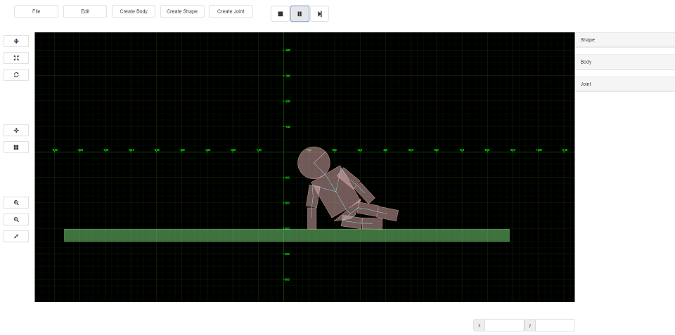

Physics Editor
==============

Physics Editor is a lightweight, bowser-based Box2d physics world editor and simulator



Features
--------

* Uses [Box2d](http://box2d.org/) for physics simulation
* Easy to use interface and visualization of box2d world
* Creating and exporting entire 2d scene, bodies or shapes
* Graphical user interface to create and edit bodies, shapes and joints
* Support for concave shapes
* Supports javascript console to edit scene using custom scripts

Usage
-----

editor.html launches the editor

#### Editor

Editor object drives the entire editor
```javascript
Editor.viewport;		// handles all the canvas events and rendering
Editor.sceneManager;	// handles selecting and editing objects
Editor.uiManager;		// handles dom events
Editor.gameView;		// handles physics simulation

Editor.resourceDirectory = "directory containing textures";	// defaults to ./resources

Editor.getCurrentSelection();	// returns an array of selected objects
Editor.getSelectedBodies();		// returns an array of selected bodies
Editor.getSelectedShapes();		// returns an array of selected shapes
Editor.getSelectedVertices();	// returns an array of selected vertices
Editor.getSelectedJoints();		// returns an array of selected joints 
```
Sample scenes are provided in the ./resources directory

#### Body
Equivalent to b2Body from Box2d

#### Shape
Equivalent to b2Shape from Box2d
Shapes can be created only when editing a body
```javascript
// shape types
Shape.SHAPE_BOX      	// rectangle shape, vertices cannot be edited, equivalent to b2PolygonShape.setAsBox
Shape.SHAPE_CIRCLE 		// cicle shape, vertices cannot be edited, equivalent to b2CircleShape
Shape.SHAPE_POLYGON 	// vertices can be edited, equivalent to b2PolygonShape.set([vertices])
Shape.SHAPE_CHAIN 		// vertices can be edited, eqivalent to b2ChainShape
````

#### Vertex
Equivalent to b2Vec2 with an exception that it stores data as array [pos_x, pos_y]

#### Joint
Equivalent to b2Joint
To create a joint, select 2 bodies
```javascript
// joint types
Joint.JOINT_DISTANCE      	// fixed distance between boides
Joint.JOINT_WELD 			// bodies are glued to each other
Joint.JOINT_REVOLUTE 		// bodies can rotate about localAnchorB
Joint.JOINT_WHEEL 			// wheel - axle joint
Joint.JOINT_PULLEY          // bodies suspended from pulley
Joint.JOINT_GEAR 			// a body can drive another body using either revolute/prismatic joint
Joint.JOINT_PRISMATIC 		// a body's translation can be constrained along an axis (localAxis)
Joint.JOINT_ROPE 			// distance between two bodies can be constrained
````
How to create joints:
* To create distance joint, select two bodies -> create distance joint
* To create weld joint, select two bodies -> create weld joint
* To create revolute joint, select two bodies -> create revolute joint
* To create wheel joint, select two bodies -> create wheel joint
* To create pulley joint, select two bodies -> create pulley joint
* To create gear joint, select two bodies and either two revolute or two prismatic joints or one revolute and one prismatic joint -> create gear joint
* To create prismatic joint, select two bodies -> create prismatic joint
* To create rope joint, select two bodies -> create rope joint

#### PolygonHelper
[Mark Bayazit's Algorithm](http://mpen.ca/406/bayazit) is used to decompose concave shapes. Concave shape is decomposed to array of convex shapes, as Box2d supports only convex shapes

#### Loading Scene
You can export scene created in editor as json file (structure for the same is available in /resources/loaders folder), which can then be loaded in game engine. Currently there are loaders available for [LibGdx](http://libgdx.badlogicgames.com/)(Java), Box2d-Web(Javascript), Cocos2d-x (c++), Apple's Sprite Kit (objective-c) and Unity3D in /resources/loaders folder
##### To use Cocos2d-x loader:
```cpp
	// make sure to add your resources folder (folder containing json file) to cocos2dx search path
	cocos2d::FileUtils::getInstance()->addSearchPath("your_folder");

	Box2dWorldLoader *loader = new Box2dWorldLoader();
	loader->setOffset(x, y);	// to translate world
	loader->loadJsonScene("file.json", b2world*);

	// to debug draw physics world just add an instance of b2DegugLayer to your current scene's layer
	yourNodeOrLayer->addChild(b2DebugLayer::create(b2world*, pixel_to_meter_ratio), ZOrder);
````

UI
--

#### Navigation

* <kbd>Left Click</kbd> drag to select multiple objects
* <kbd>Right Click</kbd> drag to pan around
* <kbd>Scroll Wheel</kbd> to zoom in and out

#### Hot Keys

* <kbd>Shift</kbd> + <kbd>D</kbd> to duplicate selection
* <kbd>Delete</kbd> to delete selection
* <kbd>w</kbd> to select translate tool
* <kbd>r</kbd> to select scale tool
* <kbd>e</kbd> to select rotate tool
* <kbd>s</kbd> to toggle snapping to grid
* <kbd>j</kbd> while selecting to mask bodies
* <kbd>b</kbd> while selecting to mask joints
* <kbd>Ctrl</kbd> + <kbd>Left Click</kbd> to add vertex to a shape while editing

##### Editing Joints:

Weld Joint
* <kbd>Shift</kbd> + <kbd>Left Click</kbd> drag on bodyA while in edit mode to change reference angle

Revolute Joint
* <kbd>Shift</kbd> + <kbd>Left Click</kbd> drag on bodyA while in edit mode to change reference angle
* <kbd>Shift</kbd> + <kbd>Left Click</kbd> drag on bodyB while in edit mode to change upper angle limit
* <kbd>Left Click</kbd> drag on bodyB while in edit mode to change lower angle limit

Wheel Joint
* <kbd>Shift</kbd> + <kbd>Left Click</kbd> drag on bodyA while in edit mode to change localAxisA

Prismatic Joint
* <kbd>Left Click</kbd> drag on bodyA while in edit mode to change localAxisA
* <kbd>Shift</kbd> + <kbd>Left Click</kbd> drag on bodyA while in edit mode to change reference angle
* <kbd>Shift</kbd> + <kbd>Left Click</kbd> drag on bodyB while in edit mode to change upper translation limit
* <kbd>Left Click</kbd> drag on bodyB while in edit mode to change lower translation limit 

Scripting
---------

Editor can utilize javascript console to edit scene throuh scripts
```javascript
// an example to make copies of selected body
// select a body to clone
// creating a circluar pattern here
var radius = 200, resolution = 10;
for (var i = 0; i < resolution; i++){
	// clone the selected body
	var b = Editor.getCurrentSelection()[0].clone();
	// set position of the body created
	b.setPosition(radius * Math.cos(i * 2 * Math.PI / resolution), radius * Math.sin(i * 2 * Math.PI / resolution));
	// add body to the scene
	Editor.getSceneManager().addBody(b);
}
```

Issues
------

* Wheel and Rope Joints are not supported in Box2d-Web, but works with the LibGDX loader
* Undo/Redo not available
* Not stable on firefox 

License
-------

Physics Editor is available under MIT license